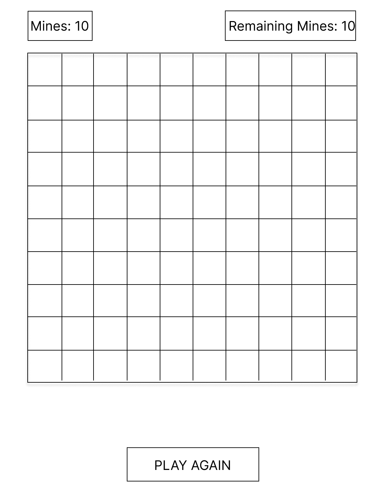

# Minesweeper

## Screenshots:
### Start of Game:

### In-Progress:

## Technologies Used:
    - HTML
    - CSS
    - JavaScript
    - Git
    - GitHub
    - GitHub Pages

## Installation Insructions:

>No installation needed!

## User Stories

1. As a player, I want some indicator that I am selecting a tile to know it worked.
1. As a player, I want to left-click to reveal tiles and right-click to mark mines.
1. As a player, when I reveal an empty tile, I want all other adjacent empty tiles to reveal themselves until numbered tiles are revealed.
1. As a player, I want my game to recognize when I have won or lost.
1. As a player, if I lose, I want my game to reveal where missed mines were located. 

## Wireframes
### Starting State:

### In-Progress:

## Major Hurdles
The first major hurdle I faced was hiding the tiles from the page. 
    In order to do this, I needed to have an element covering the base tile so that I can have the click reveal it later on. To accomplish this, I had to make heavy use of pseudo elements in CSS (specifically `::after`) because it allowed puts the pseudo content in the same location as the main element. So all I had to do was make this pseudo element take up 100% of the space of the tile and give it a background color, and everything was hidden! Finding this use of ::after as a cover was pretty difficult though, since it doesn't seem to be a common use for pseudo elements.
    
The next major hurdle I faced was hiding the tile information from dev tools to prevent cheating and figuring out where the mines are without actually playing. 
    To do this, I had to use a css variable and the `:root` pseudoclass to hold it and make it useable in a pseudo element (another `::after`). This allowed me to add in background images corresponding with the tile's content dynamically as the tile was clicked. This prevents previewing the tile's content - which prevents cheating.

The final large hurdle I faced while working on this MVP version was the recursive function to repeatedly click adjacent blank tiles. 
    After extensive research and moving conditional statements around, I found out that my issue was my tracker to see where the function had already gone was not properly tracking that information because I had not put it in the beginning of the function right after the exit condition, and once I did that the function reacted properly.